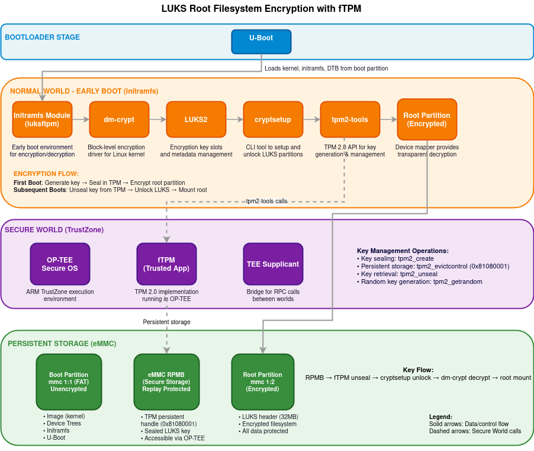

.. _filesystem-encryption:

################################
File System Encryption with fTPM
################################

************
Introduction
************

Data security is essential in modern embedded systems, be it industrial, 
automotive or IoT applications. This guide provides a reference 
implementation for root filesystem encryption by using Trusted Platform 
Module (TPM) protected keys on TI K3 platforms.

**Yocto-Based Implementation:**

This is a Yocto based implementation integrated into the Processor SDK. 
It provides recipes and configuration for LUKS2 full-disk encryption 
with automatic first-boot encryption and following boots decryption, 
all controlled through Yocto recipes. 
The implementation here leverages a firmware TPM (fTPM) running 
in OP-TEE to protect encryption keys, with secure persistent storage 
in TPM's persistent handles. The solution provides strong data-at-rest
protection without requiring discrete TPM hardware.

************
Key features
************

- **TPM-protected keys**: Firmware TPM generates and seals encryption 
  keys during first boot
- **Automatic In-place encryption**: First-boot encryption (in-place)
  and next boot decryption happen automatically
- **Secure key storage**: Keys stored in TPM persistent storage 
  accessed through TPM 2.0 APIs

********
Concepts
********

Root Filesystem Encryption
==========================

Root filesystem encryption protects data at rest by encrypting the 
filesystem (root partition of SD card). This protection exists even if 
the storage device is physically removed from the system.
The Linux kernel uses **dm-crypt** (Device Mapper Crypt) for 
block-level encryption, with **LUKS** (Linux Unified Key Setup) managing 
encryption parameters and key slots.

Firmware TPM (fTPM)
===================

A firmware TPM (fTPM) implements the TPM 2.0 specification as a 
Trusted Application running within OP-TEE's secure environment:

- **Key generation**: Creates cryptographically strong keys using 
  hardware entropy
- **Key sealing**: Protects keys so only authorized parties can access 
  them in a known secure state 
- **Secure storage**: Stores TPM state in tamper-resistant eMMC 
  Replay Protected Memory Block (RPMB)

eMMC RPMB
=========

Replay Protected Memory Block (RPMB) is a secure partition in eMMC storage:

- **Authentication**: Only accepts authenticated write operations
- **Replay protection**: Prevents replay attacks with write counters
- **Limited access**: Only accessible through OP-TEE secure environment

The fTPM stores its persistent state in eMMC RPMB through OP-TEE's secure 
backend.

**********************
Implementation Details
**********************

System Architecture
===================

The filesystem encryption implementation consists of several components 
working together across the boot process:

- **Boot loader** : U-Boot loads kernel, initramfs and DTBs into memory
  from unencrypted boot partition
- **Linux Kernel**: Provides the core cryptographic functionality through
  the Device Mapper subsystem
- **Initramfs**: Contains the early boot environment where 
  encryption/decryption occurs
- **OP-TEE**: Secure operating system running in TrustZone that hosts the 
  firmware TPM
- **eMMC Storage**: provides tamper-resistant key storage with RPMB

Boot Process Flow
=================

The encryption system operates during the Linux boot process:

#. **Boot loader Stage**: U-boot loads the kernel and initramfs into memory
#. **Early Boot**: The kernel starts and mounts the initramfs as a 
   temporary root filesystem
#. **TPM Initialization**: The firmware TPM is initialized within OP-TEE
#. **Encryption Detection**: The system checks if the root partition is 
   already encrypted
#. **Encryption/Decryption**: Based on the detection result, the system 
   either:

   - Performs first-time in-place encryption of the root filesystem
   - Retrieves the key from TPM and decrypts the existing encrypted filesystem
#. **Root Switch**: Control is transferred to the actual root filesystem

Key Management Flow
===================

The encryption key lifecycle is managed securely:

#. **Key Generation**: During first boot, the TPM generates a random 
   encryption key
#. **Key Sealing**: The key is sealed by the TPM, protecting it from 
   unauthorized access
#. **Key Storage**: Sealed key data is stored in eMMC RPMB through the 
   TPM's secure storage
#. **Key Retrieval**: During later boots, the key is unsealed by 
   the TPM

Encryption Process
==================

The in-place encryption process follows these steps:

#. **Filesystem Preparation**: The filesystem is checked and resized to
   make room for LUKS headers
#. **Space Verification**: The system ensures at least 32MB is available 
   for LUKS metadata
#. **Encryption Initialization**: LUKS headers are written to the beginning
   of the partition
#. **Block Encryption**: Data blocks are read, encrypted, and written back 
   to storage
#. **Filesystem Expansion**: After encryption, the filesystem is expanded
   to use available space

*****
Setup
*****

The fTPM based filesystem encryption support is available in Yocto. The 
following section acts as the guide for setting it up.
Please use :ref:`Processor SDK - Building the SDK with Yocto 
<building-the-sdk-with-yocto>` as reference while following the below 
steps specific to LUKS:

#. Use the latest :ref:`oe-config file <yocto-layer-configuration>`, using
   the LUKS specific config.
#. Before building the SDK image, there are few **prerequisites**:

   - **Writing keys to eMMC RPMB** : The implementation here uses RPMB keys 
     for secure persitance storage. Writing keys into RPMB is a one-time 
     and non-reversible step, follow :ref:`secure-storage-with-rpmb` 
   - Once the keys are written to RPMB, the optee-os and optee-client 
     components in Yocto should be configured to make use of these 
     hardware keys.

     The following explains how Yocto should be configured:

     - **optee-os**: under the ``meta-ti`` layer
       :file:`meta-ti-bsp/recipes-security/optee/optee-os-ti-overrides.inc`

       Enable ``RPMB`` support.

       .. code-block:: console

          EXTRA_OEMAKE:append:k3 = " \
             CFG_REE_FS=n \
             CFG_RPMB_FS=y \
             CFG_RPMB_WRITE_KEY=y \
             CFG_RPMB_ANNOUNCE_PROBE_CAP=n \
          " 

     - **optee-client**: under the ``meta-ti`` layer 
       :file:`meta-ti-bsp/recipes-security/optee/optee-client_%.bbappend`

       Disable RPMB emulation mode.

       .. code-block:: console

          EXTRA_OECMAKE:append = " -DRPMB_EMU=OFF"

     - **u-boot**: The kernel Image and dtbs are read from the root 
       partition of SD by default. Since this implementation encrypts the root 
       filesystem, u-boot needs to be configured to pick kernel image, dtbs
       and initramfs from the boot partition. This can be done by overriding
       the ``CONFIG_BOOTCOMMAND``:

       .. ifconfig:: CONFIG_part_variant in ('AM62LX')

          .. code-block:: console

             CONFIG_BOOTCOMMAND="setenv bootargs console=ttyS0,115200n8 earlycon=ns16550a,mmio32,0x02800000 root=/dev/mmcblk1p2 rootwait rootfstype=ext4; load mmc 1:1 0x82000000 /Image; load mmc 1:1 0x88080000 /ti-core-initramfs.cpio.xz; setenv initrd_size ${filesize}; load mmc 1:1 0x88000000 /k3-am62l3-evm.dtb; booti 0x82000000 0x88080000:${initrd_size} 0x88000000"

       .. ifconfig:: CONFIG_part_variant not in ('AM62LX')

          .. code-block:: console

             CONFIG_BOOTCOMMAND="setenv bootargs console=ttyS2,115200n8 earlycon=ns16550a,mmio32,0x02800000 root=/dev/mmcblk1p2 rootwait rootfstype=ext4; load mmc 1:1 0x82000000 /Image; load mmc 1:1 0x88080000 /ti-core-initramfs.cpio.xz; setenv initrd_size ${filesize}; load mmc 1:1 0x88000000 /<DTB_NAME>.dtb; booti 0x82000000 0x88080000:${initrd_size} 0x88000000"

     - **Additional configs**: The following can be added in local.conf of yocto build:

       - To copy dtbs to boot patition for post encryption boot:

         .. code-block:: console

            IMAGE_BOOT_FILES:append = " *.dtb"

       - Adding free space in rootfs for LUKS encryption (since LUKS expects 
         atleast 32MB of free space for header post resize2fs operations):

         .. code-block:: console

            IMAGE_ROOTFS_EXTRA_SPACE = "65536"

- Some other useful configurations (**not mandatory** to have):

   - In order to use tpm2 tools in Linux command line, add following in 
     local.conf:

     .. code-block:: console

        IMAGE_INSTALL:append = " \
            tpm2-tools \
            tpm2-tss \
            libtss2-tcti-device \
        "

   - The size of initramfs image can be reduced by using busybox: 

     .. code-block:: console

        VIRTUAL-RUNTIME_init_manager:pn-packagegroup-ti-core-initramfs = "busybox"
        VIRTUAL-RUNTIME_dev_manager:pn-packagegroup-ti-core-initramfs = "busybox"

********************
dm-crypt performance
********************

- The first boot involves encryption of complete root filesystem using the
  ARM aes-generic (software implmentation), giving around 17.0 MB/s of
  performance. This makes use of :command:`cryptsetup reencrypt` which reads, 
  encrypts and writes back data. Therefore, the first boot is expected 
  to take more time dependending on the size of filesystem.
- The next boots involve decryption of data, giving around 86 MB/s
  of decryption throughput.

***********************
Security Considerations
***********************

Reference Implementation
========================

This implementation serves as a reference design that demonstrates the 
integration of filesystem encryption with firmware TPM. It is **not intended 
for direct use in production environments without appropriate security 
review** and customization including:

- **Threat model evaluation**: a thorough threat assessment should be 
  conducted before deployment
- **Key management**: The default TPM persistent handle (0x81080001) 
  should be reviewed for security requirements
- **Boot process hardening**: The initramfs module may need modifications 
  to align with specific security policies
- **Recovery mechanisms**: Production implementations may require key 
  recovery procedures

Further Enhancements
====================

Implementation of this reference design can have following enhancements:

- **Integrating with secure boot**: Establish a verified chain of trust 
  from ROM to filesystem
- **Passphrase Recovery**: Incase the TPM keys become inaccessible during
  boot, the current implementation doesn't use any backup passphrase 
  recovery method resulting in **potential data loss**. Using a passphrase 
  would reduce risk of data loss but introduces additional security 
  considerations.
- **Measured boot**: Add TPM PCR measurements to bind keys to verified 
  software state, the current reference doesn't use PCR measurements
- **Audit logging**: Add secure logging of encryption/decryption 
  operations for compliance purposes

